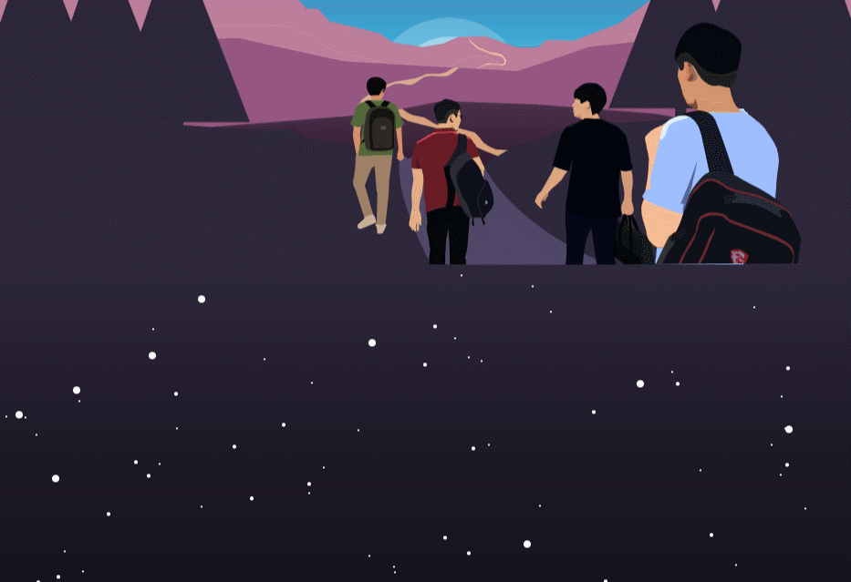
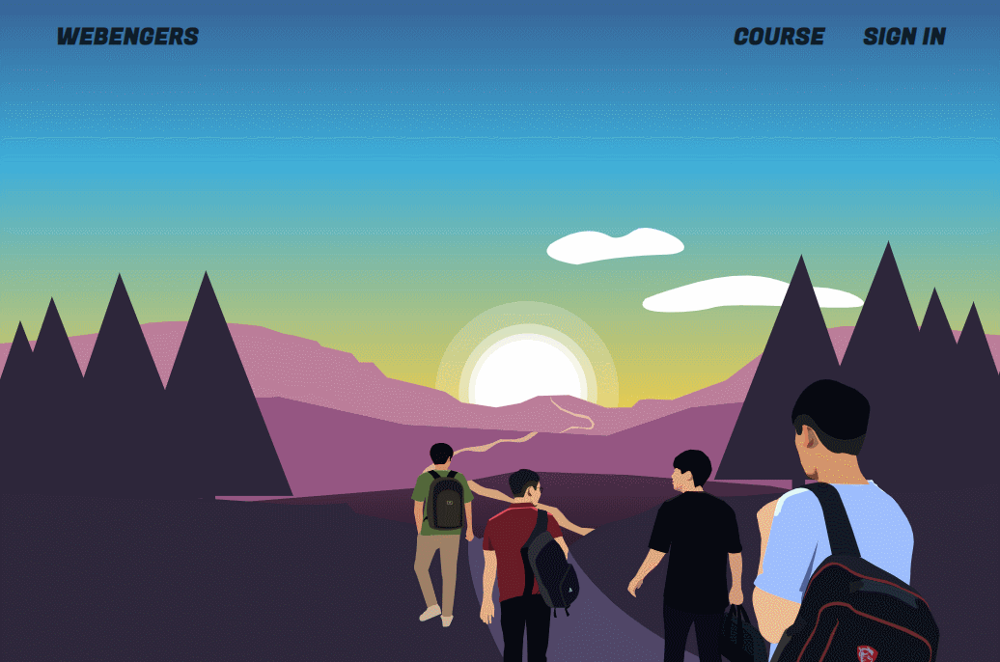

# 팀 랜딩 페이지 제작

> 팀을 위한 기술 블로그의 랜딩 페이지를 제작하였습니다.

AWS S3와 CloudFront에 배포한 후 Domain을 구입하여 연결하였습니다.

https://www.webengers.space


## Install

```bash
$ npm install
$ yarn start
```


## 개발 환경

기술 스택 : React.js, Sass, AWS S3, AWS CloudFront, Illustrator

버전 관리 : Git

자원 관리 : Notion.so


## 개발 내용

#### 메인 페이지

웹 개발자가 되기 위해 나아간다는 느낌의 화면을 구성하고 싶었습니다.

Illustrator를 이용해 SVG로 구성하여 css와 javascript로 애니메이션 효과를 주었고, 화면의 크기와 상관없이 같은 화질을 유지하게 하였습니다.


#### 팀 소개 페이지

팀원들이 모여 로켓을 만들어 나아간다는 느낌을 담고 싶었습니다.

개개인을 클릭하면 상세 페이지를 볼 수 있습니다.




###### HTML 구성

```html
<div id="home">
    <div id="home1" className="home__aboutteam">
        <TopNav/>
        <div className="home__aboutteam__bg">
            <div className="home__aboutteam__sunlight"/>
            <div className="home__aboutteam__bgimage">
                <BackgroundSvg/>
            </div>
        </div>
    </div>
    <div id="home2" className="home__abouteach">
        <div id="stars1"/>
        <div id="stars2"/>
        <div id="stars3"/>
        <BgSvg2/>
    </div>
</div>
```

###### 별이 흘러가는 css의 일부

```css
@function multiple-box-shadow($n) {
    $value: '#{random(3000)}px #{random(3000)}px #FFF';
    @for $i from 2 through $n {
        $value: '#{$value}, #{random(3000)}px #{random(3000)}px #FFF'
    }
    @return unquote($value);
}
@keyframes StarAni {
    from {
        transform: translateX(0px);
    }
    to {
        transform: translateX(-3000px);
    }
}
$shadows-small: multiple-box-shadow(1000);
$shadows-middle: multiple-box-shadow(500);
$shadows-large: multiple-box-shadow(100);
.star--animate {
    #stars1 {
        position: relative;
        width: 2px;
        height: 2px;
        border-radius: 50%;
        background: transparent;
        box-shadow: $shadows-small;
        animation: StarAni 100s 15s linear infinite;
        z-index: 1;
        &::after {
            content: "";
            position: absolute;
            left: 3000px;
            width: 2px;
            height: 2px;
            border-radius: 50%;
            background: transparent;
            box-shadow: $shadows-small;
        }
    }
}
```

###### 자동 애니메이션 구성 Javascipt

```js
animationOn = (e) => {
    if (e.deltaY > 0) {
        let svg2 = document.querySelector('#bgsvg2')
        svg2.classList.add('animate')
        let home2 = document.querySelector('#home2')
        home2.classList.add('star--animate')
        setTimeout(() => {
            // 임시로 delay 1초로 설정해 놓음, 16초로 설정해야함.
            document.querySelector('#bgsvg2').classList.add('hover--enable')
            document.querySelector('#kbs-p').addEventListener('click', () => {
                // 인자 : memberNames의 index값, const memberNames = ['kbs', 'lmk', 'yco', 'ldm']
                this.modalOn(0)
            })
            document.querySelector('#lmk-p').addEventListener('click', () => {
                this.modalOn(1)
            })
            document.querySelector('#yco-p').addEventListener('click', () => {
                this.modalOn(2)
            })
            document.querySelector('#ldm-p').addEventListener('click', () => {
                this.modalOn(3)
            })
        }, 1000)
        window.removeEventListener('wheel', this.animationOn)
    }
}
```


#### 페이지 단위 스크롤

setTimeout을 이용해 스크롤 도중 스크롤이 일어나도 오동작하지 않도록 하였습니다.

```js
pageScroll = (e) => {
    if (!timer) {
        let y = e.deltaY
        if (y > 0) {
            if (this.state.currentpage < 3) {
                this.state.currentpage++
            }
        } else {
            if (this.state.currentpage > 1) {
                this.state.currentpage--
            }
        }
        var transY = 100*(this.state.currentpage-1)
        document.querySelector('#home').style.transform = `translateY(-${transY}vh)`
        timer = setTimeout(function() {
            timer = null
        }, 1000)
    }
}
```



